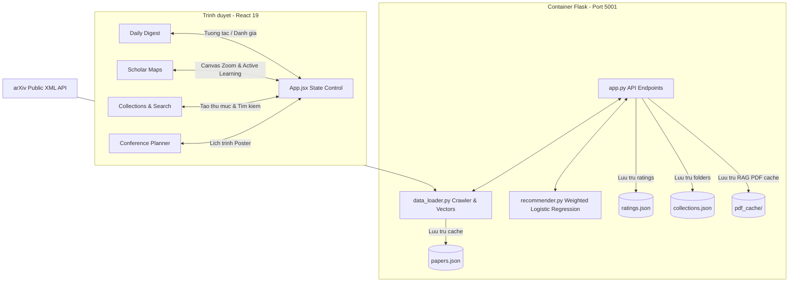

# Tai lieu Kien truc Ky thuat va dac ta Ma nguon Scholar Inbox

Tai lieu nay cung cap dac ta chi tiet ve kien truc phan mem, luong du lieu, cac cong thuc toan hoc cot loi va cac so do JSON API phuc vu cho viec phat trien va duy tri he thong Scholar Inbox.

---

## 1. Tong quan Kien truc va Luong Du lieu

He thong duoc thiet ke theo mo hinh Client-Server doc lap, dong goi hoan toan trong Docker. Cong ket noi cua Backend duoc dieu chinh sang cong 5001 tren host de tranh xung dot tren macOS.



### Luong van hanh:
1. **Ingestion**: Backend tai ve 200 bai bao tu arXiv, trich xuat tieu de, abstract, thong tin tac gia va tao ma tran TF-IDF.
2. **Dimension Reduction**: Thuat toan t-SNE chieu ma tran vector ve khong gian 2 chieu (X, Y) va gui sang Frontend trinh dien.
3. **Recommendation**: Khi nguoi dung danh gia Upvote/Downvote, Backend train lai model Logistic Regression va tinh lai Relevance Score cho toan bo papers.

---

## 2. Cau truc thu muc (Project Structure)

```text
/Users/toilaluongg/Desktop/UIT -SDH/LLM
├── Dockerfile                  # Chi thi Docker build cho React Frontend
├── README.md                   # Tai lieu huong dan khoi chay nhanh
├── TECHNICAL.md                # Tai lieu chi tiet kien truc & toan hoc (Tep nay)
├── docker-compose.yml          # Phoi hop khoi dong container Frontend & Backend
├── index.html                  # HTML goc chua SEO Meta-tags
├── package.json                # Dependency list cua React Frontend
├── vite.config.js              # Cau hinh Vite dev server va build
├── src/                        # Ma nguon React Frontend
│   ├── App.jsx                 # Central State Controller, dieu phoi API calls
│   ├── index.css               # He thong CSS bien dark-mode va hieu ung glassmorphic
│   ├── main.jsx                # Entrypoint cua React DOM
│   └── components/             # Cac view thanh phan
│       ├── DailyDigest.jsx     # Card bai bao, highlight abstract, modal PDF, sidebar RAG Chat
│       ├── ScholarMap.jsx      # Science Map ve bang Canvas 2D, zoom nac, Active Learning
│       ├── Collections.jsx     # Tim kiem prefix-match, quan ly thu muc va goi y centroid
│       ├── ConferencePlanner.jsx # Xep hang phien poster, lich trinh ca nhan
│       └── ResearchWorkspace.jsx # Giao dien tab lam viec Multi-Agent quan sat log thoi gian thuc
└── backend/                    # Ma nguon Python Backend
    ├── Dockerfile              # Docker build cho Flask Backend
    ├── app.py                  # API endpoints, dinh tuyen cac truy van phuc vu he thong
    ├── data_loader.py          # Tai arXiv XML, regex highlights, TF-IDF, t-SNE reduction
    ├── recommender.py          # Custom weighted Logistic Regression model
    ├── llm_helper.py           # Ket noi Gemini API, bo tru van embedding va heuristics
    ├── agent_orchestrator.py   # Do thi trang thai LangGraph Multi-Agent, search, critic, synthesizer
    ├── requirements.txt        # Thu vien Python (flask, flask-cors, numpy, scikit-learn, pypdf, langgraph)
    ├── test_recommender.py     # Kich ban test toan hoc he thong de xuat
    ├── test_llm.py             # Kich ban test goi y trich loc heuristics/Gemini
    ├── test_rag.py             # Kich ban test engine phan doan cat chunk RAG PDF
    ├── test_agents.py          # Kich ban test he thong Multi-Agent LangGraph
    └── pdf_cache/              # Thu muc cache van ban PDF tu arXiv phuc vu RAG
```

---

## 3. Thuat toan de xuat ca nhan hoa (Recommender Mathematics)

De giai quyet bai toan mat can bang du lieu giua so luong it upvote ($n_P$) va kho du lieu rat lon, paper de xuat he thong Weighted Binary Cross-Entropy Loss (Muc 3.1.1):

### 3.1 Cong thuc Loss function
$$L = \frac{1}{n_T} \sum_{i=1}^{n_T} -w_i \left[ y_i \log \hat{y}_i + (1 - y_i) \log (1 - \hat{y}_i) \right]$$

Trong do:
*   $n_T = n_P + n_N + n_R$: Tong so luong mau dua vao train.
*   $n_P$: So luong bai bao duoc Upvote.
*   $n_N$: So luong bai bao duoc Downvote (Explicit negatives).
*   $n_R$: Mau am ngau nhien lay tu tap chua danh gia de can bang ranh gioi (Random negatives).
*   $\hat{y}_i$: Xac suat mo hinh du doan nguoi dung thich bai viet thu $i$.
*   $w_i$: Trong so phat tuong ung cua mau.

### 3.2 Tinh toan trong so phat (Sample Weights)
Trong so trung gian duoc can bang theo ty le:
$$\tilde{w}_P = \frac{1}{n_P}$$
$$\tilde{w}_N = \frac{S \cdot V}{V \cdot n_N + (1 - V) n_R}$$
$$\tilde{w}_R = \frac{S \cdot (1 - V)}{V \cdot n_N + (1 - V) n_R}$$

Trinh hieu chinh do lech (Bias Correction) bang cach nhan voi tong so mau $n_T$:
$$w_P = n_T \tilde{w}_P, \quad w_N = n_T \tilde{w}_N, \quad w_R = n_T \tilde{w}_R$$

### 3.3 Tham so tieu chuan
*   $C = 0.1$: Nghieng bien chuan hoa L2 giup tranh overfitting khi it ratings.
*   $V = 0.8$: Ti le uutien explicit negatives. Downvote cang nhieu thi do quan trong cua explicit negatives cang lam lu mo random negatives.
*   $S = 5.0$: He so lam mat can bang phat mau am so voi mau duong.

---

## 4. Cac Thuat toan Toi uu hoa Nang cao

### 4.1 Thuat toan RAG PDF Phan cap (Parent-Child Chunking)
*   **Van de**: Cat chu co hoc theo do dai tinh lam gay cac cum tu ky thuat hoac cong thuc.
*   **Giai phap**:
    - **Manh con (Child Chunks - 300 ky tu, overlap 50)**: Dung lam ma tran index tim kiem TF-IDF giup dat do chinh xac cuc bo rat cao khi nguoi dung gui cau hoi.
    - **Manh cha (Parent Chunks - 1500 ky tu, overlap 300)**: Chua truyen dat va bao quanh manh con tuong ung.
*   **Luong van hanh**:
    1. So khop cau hoi voi danh sach Child Chunks bang TF-IDF Cosine Similarity.
    2. Trich ra Top 3 Child Chunks co diem cao nhat.
    3. Lay ra Parent Chunks tuong ung lam Context gui cho LLM. Giai phap nay giup LLM bao quat tron ven paragraph de suy luan dung.

### 4.2 Thuat toan Active Learning Da dang (K-Means Diversity AL)
*   **Van de**: Cac bai bao gan ranh gioi quyet dinh ($w^T x + b \approx 0$) thuong rat giong nhau do nam cung 1 cum chu de, gay lap lai khi hien thi 5 bai khao sat.
*   **Giai phap**:
    1. Loc ra Top 20 bai bao chua danh gia gan ranh gioi quyet dinh nhat.
    2. Chay **K-Means ($k=5$)** tren toa do 2D t-SNE ($x, y$) cua 20 bai bao nay.
    3. Trong moi cum, lay ra bai bao gan tam cum (centroid) nhat lam dai dien de tra ve cho nguoi dung.
*   **Ket qua**: 5 bai khao sat se thuoc ve 5 vung chu de khac nhau tren ban do, giup cap nhat so thich nguoi dung nhanh nhat.

---

## 5. Dac ta dac diem va JSON Schema API Endpoints

### 5.1 GET /api/papers
Tra ve toan bo danh sach cac bai bao kem thong tin phan tich.
*   **Request**: None.
*   **Response JSON Schema**:
    ```json
    {
      "papers": [
        {
          "id": "2606.28323",
          "arxiv_url": "https://arxiv.org/abs/2606.28323",
          "title": "DexCompose: Reusing Dexterous Policies...",
          "abstract": "Dexterous manipulation policies can solve...",
          "authors": ["Dihong Huang", "Zhenyu Wei"],
          "published": "2026-06-29",
          "primary_category": "cs.LG",
          "category_name": "Machine Learning",
          "highlight": "By separating grasp preservation from...",
          "bibtex": "@article{huang2026dexcompose,\n  author = ...}",
          "x": -12.4,
          "y": 45.2,
          "relevance_score": 0.0
        }
      ]
    }
    ```

### 5.2 POST /api/rate
Ghi nhan upvote/downvote va cap nhat model de xuat.
*   **Request JSON Schema**:
    ```json
    {
      "paper_id": "2606.28323",
      "rating": 1
    }
    ```
    *Ghi chu: rating = 1 (Upvote), -1 (Downvote).*
*   **Response JSON Schema**:
    ```json
    {
      "status": "success",
      "papers": [ ... ]
    }
    ```

### 5.3 POST /api/explain
Sinh giai thich tai sao bai bao duoc de xuat.
*   **Request JSON Schema**:
    ```json
    {
      "paper_id": "2606.28323",
      "api_key": "YOUR_GEMINI_API_KEY_OPTIONAL"
    }
    ```
*   **Response JSON Schema**:
    ```json
    {
      "reason": "Bai bao nay tap trung vao prestrained policy reuse, rat phu hop voi quan tam cua ban ve Reinforcement Learning va robot control...",
      "key_points": [
        "Gioi thieu framework DexCompose",
        "Dat hieu suat 77.4% tren 16 composite tasks"
      ],
      "source": "Gemini LLM"
    }
    ```

### 5.4 POST /api/chat-pdf
Thuc hien truy van RAG hoi dap tren PDF.
*   **Request JSON Schema**:
    ```json
    {
      "paper_id": "2606.28323",
      "question": "What is the primary method proposed for multi-task manipulation?",
      "api_key": "YOUR_GEMINI_API_KEY_OPTIONAL"
    }
    ```
*   **Response JSON Schema**:
    ```json
    {
      "answer": "The primary method proposed is DexCompose, which uses role-aware finger ownership...",
      "retrieved_chunks": [
        {
          "child_text": "study multi-stage dexterous manipulation...",
          "text": "The third direction exploits multi-finger hands...",
          "page_idx": 3,
          "score": 0.174
        }
      ]
    }
    ```

### 5.5 POST /api/agent/chat
Kich hoat do thi tac tu LangGraph de lam Literature Review.
*   **Request JSON Schema**:
    ```json
    {
      "query": "Sequential dexterity and pretrained policies",
      "api_key": "YOUR_GEMINI_API_KEY_OPTIONAL"
    }
    ```
*   **Response JSON Schema**:
    ```json
    {
      "report": "# Literature Review: Sequential dexterity...\n## 1. Introduction...",
      "logs": [
        {
          "agent": "ArxivSearchAgent",
          "message": "Analyzing query keywords..."
        },
        {
          "agent": "PaperCriticAgent",
          "message": "Analyzing methodology..."
        }
      ]
    }
    ```

---

## 6. Co che Hoat dong cua Frontend React

### 6.1 Interactive 2D Canvas Scatterplot (`ScholarMap.jsx`)
*   Su dung Canvas 2D vi so luong diem lon. Tich hop cac event handlers:
    - `onMouseDown` va `onMouseMove`: Tinh toan do lech toa do delta de dich chuyen offset ban do.
    - `onWheel`: Cap nhat muc tile zoom va dich chuyen map-center tuong ung de giu nguyen diem focus chuot.
*   **Dynamic Hierarchy Labels**: Tinh toan centroid trung binh cua tung phan vung cac categories. Tuy thuoc vao ti le phong to `zoomScale`, Frontend se render cac nhan:
    - Zoom thap (< 1.5): Hien thi nganh lon (`category_name` nhu "Computer Vision").
    - Zoom trung binh (1.5 - 3.5): Hien thi cac cum phan vung chi tiet hon.
    - Zoom cao (> 3.5): Hien thi tieu de chi tiet cac bai bao.

### 6.2 Offline Fallback prefix matching (`Collections.jsx` va `app.py`)
De dam bao tinh nang tim kiem hoat dong on dinh ca khi mang cham hoac mat ket noi, phan mem thiet lap tu duy ngu canh check prefix-match thong qua Regex ranh gioi tu.
*   Tu khoa query duoc tach chu: `queryWords = query.toLowerCase().split(' ').filter(Boolean)`.
*   Bieu thuc chinh quy duoc bien so: `new RegExp('\\b' + escapedWord)`. Giup loai tru cac ket qua khop tu con khong mong muon (vi du: go `"ch"` se khong map pham vi tu `"technology"`).

### 6.3 Giao dien Tab AI Research Workspace (`ResearchWorkspace.jsx`)
*   Giao dien giup nguoi dung truc tiep tuong tac va quan sat hanh vi suy nghi, ra quyet dinh cua he thong Multi-Agent:
    - **Panel giam sat log (Agent Execution Monitor)**: Hien thi tung message log duoc day ra tu truong `logs` cua LangGraph phuc vu tinh minh bach.
    - **Khung preview Literature Review**: Trinh bay truc tiep bao cao Markdown, di kem mot nut copy nhanh vao clipboard de viet lach khoa hoc.
